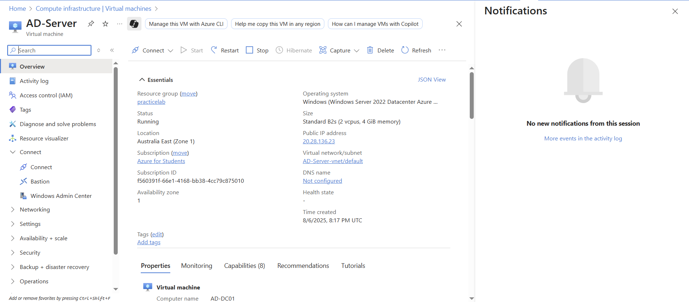
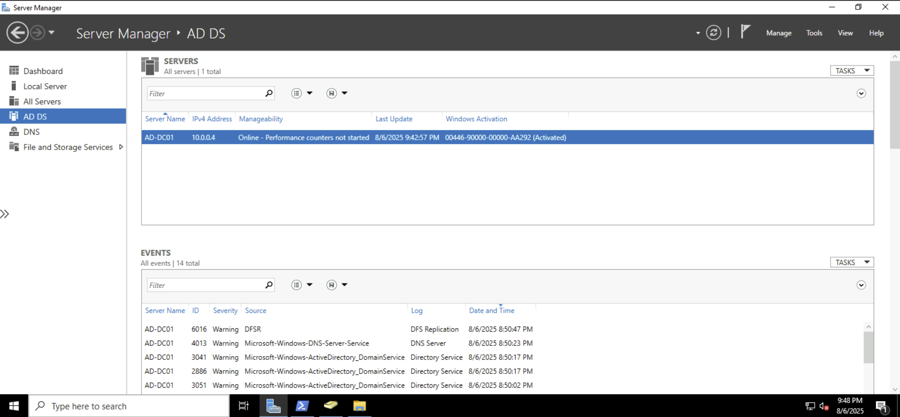
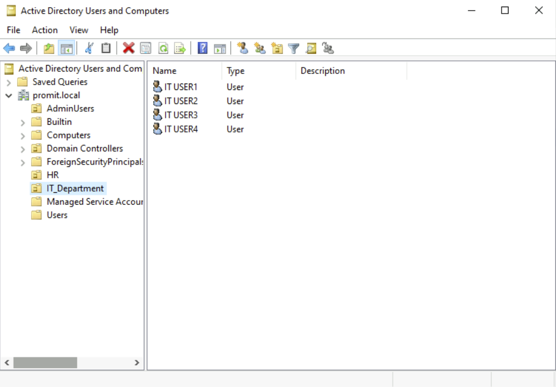

# 🖥️ Active Directory Lab on Azure VM

## 🔧 Overview
This project demonstrates the deployment and configuration of a basic **Active Directory Domain Services (AD DS)** environment on a **Windows Server 2022** virtual machine hosted in **Microsoft Azure**. The setup replicates real-world IT administrative tasks such as domain configuration, OU structuring, user account creation, and PowerShell automation.

---

## 🛠️ Environment
- **Platform:** Microsoft Azure (Azure for Students)
- **Operating System:** Windows Server 2022 Datacenter (Azure Edition)
- **Domain:** `promit.local`
- **Server Name:** `AD-Server`
- **Tools Used:** Server Manager, Active Directory Users and Computers (ADUC), PowerShell

---

## ✅ Tasks Completed
- Provisioned a Windows Server 2022 VM using Azure
- Installed **Active Directory Domain Services (AD DS)**
- Created a new domain: `promit.local`
- Created Organizational Units (OUs) to simulate a company structure:
  - `IT_Department`
  - `HR`
  - `AdminUsers`
- Added users manually and via PowerShell into respective OUs


```text
promit.local
├── IT_Department
│   ├── IT USER1
│   └── IT USER2
├── HR
│   └── HR USER1
└── AdminUsers
    └── Admin USER1
```

*(Additional users created using PowerShell: IT USER3, HR USER2, Admin USER2)*

## 💻 PowerShell Script

A PowerShell script was created to automate the creation of users inside each OU.

📄 [Create-OU-Users.ps1](./Create-OU-Users.ps1)

Key features:
- Automatically assigns users to specific OUs
- Sets secure default passwords
- Enables accounts upon creation

---

## 🖼️ Screenshots

| Description | Screenshot |
|------------|------------|
| Azure VM Setup |  |
| AD DS Installed |  |
| OU Structure |  |

---

## 🎯 Skills Demonstrated
- Deploying and configuring VMs in Azure
- Installing and managing Active Directory Domain Services
- Creating and managing OUs and user accounts
- Automating tasks with PowerShell
- Documenting IT infrastructure environments

---

## 📌 Notes
This project showcases core IT support and sysadmin skills, and is part of a growing portfolio designed to demonstrate job-ready technical competencies in Windows Server environments and enterprise IT systems.


